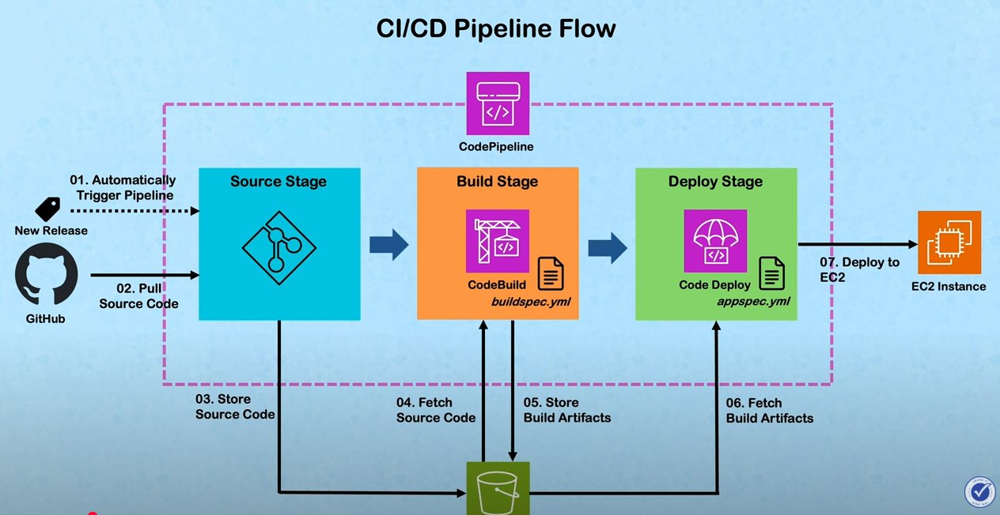
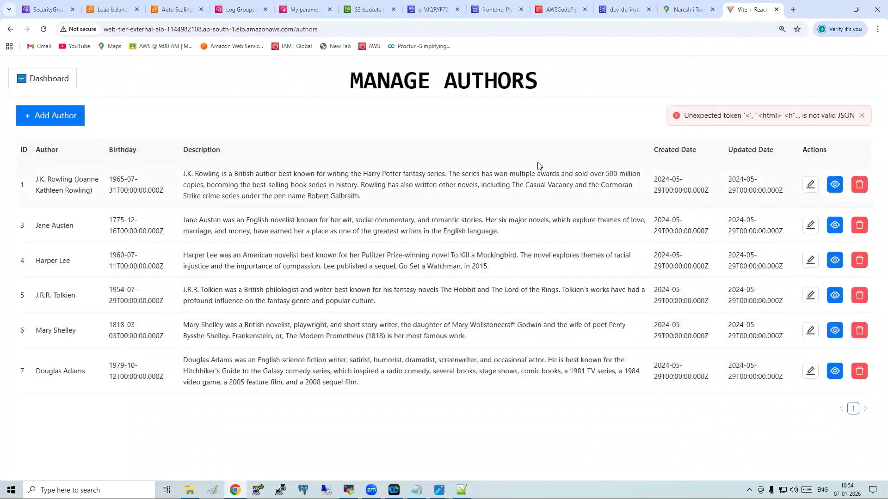
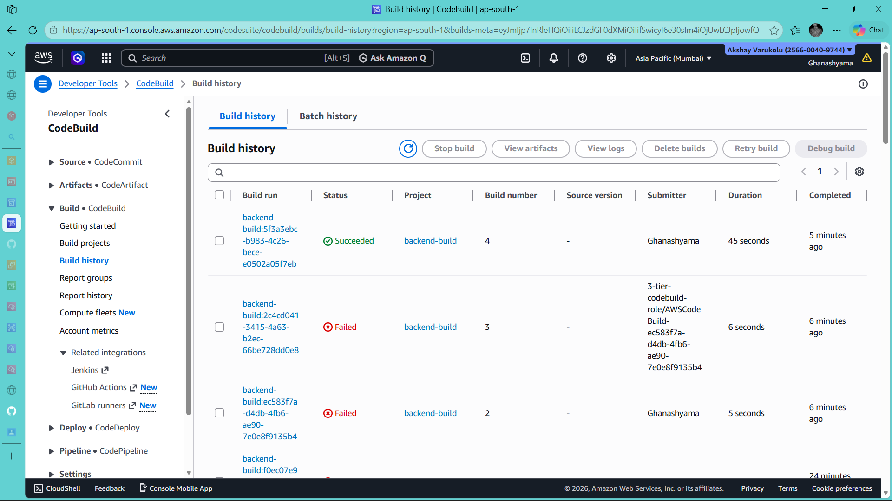
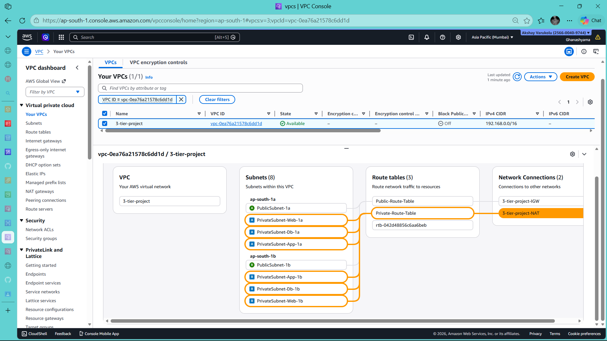

<div align= "center">
  
# AWS 3-Tier Production Architecture with Terraform & CI/CD


</div>

---

## 📌 Overview

This repository demonstrates a **production-grade AWS 3-Tier architecture** built using **Infrastructure as Code (Terraform)** and **automated CI/CD pipelines**.

> **Focus of this project:** The goal here is **not** the application code — a reference React + Node.js app is used as a deployment target. The real work is the **cloud infrastructure design, Terraform provisioning, and end-to-end CI/CD automation** built around it.

The project deploys a **scalable, highly available full-stack application** with separate **Web, Application, and Database tiers**, following real-world DevOps and cloud best practices.

Infrastructure provisioning is handled using **Terraform**, while application deployments are automated using **AWS CodePipeline, CodeBuild, and CodeDeploy**.

---

## 🏗 Architecture Overview



### 🔹 3-Tier Design

* **Web Tier**
  * Frontend application served via **Nginx**
  * EC2 instances behind an **External Application Load Balancer**
  * Auto Scaling enabled

* **Application Tier**
  * **Node.js backend** application
  * EC2 instances behind an **Internal Application Load Balancer**
  * Auto Scaling enabled

* **Database Tier**
  * **Amazon RDS (MySQL)**
  * Deployed in private subnets
  * No public access

### 🔹 High Availability & Security

* Multi-AZ deployment
* Public & private subnet isolation
* IAM roles with least privilege
* Security groups with controlled access
* Secrets managed via **AWS SSM Parameter Store**

---

## ⚙️ Infrastructure as Code (Terraform)

All cloud infrastructure is provisioned using **Terraform**, ensuring:

* Repeatable deployments
* Version-controlled infrastructure
* Easy environment recreation

Terraform manages:

* VPC & networking
* Security groups
* EC2 launch templates
* Load balancers
* Auto Scaling Groups
* RDS MySQL
* IAM roles & policies
* User data scripts

---

## 🔁 CI/CD Pipeline Workflow

### 🔹 Source

* GitHub repository
* Webhook-based triggers

### 🔹 Build (AWS CodeBuild)

* Separate builds for backend and frontend
* Uses `buildspec.yml`
* Fetches secrets securely from **SSM Parameter Store**
* Artifacts stored in private S3 bucket

### 🔹 Deploy (AWS CodeDeploy)

* In-place deployments
* Integrated with Auto Scaling Groups
* Load balancer aware deployments

### 🔹 Orchestration

* AWS CodePipeline
* Independent pipelines for:
  * Backend (Application tier)
  * Frontend (Web tier)

---

## 🚀 Getting Started

### Prerequisites

Make sure the following tools are installed and configured before deploying:

* [Terraform >= 1.0](https://developer.hashicorp.com/terraform/downloads)
* [AWS CLI](https://docs.aws.amazon.com/cli/latest/userguide/install-cliv2.html) configured with appropriate credentials
* An AWS account with permissions to create VPCs, EC2, RDS, IAM, CodePipeline, and related services
* A GitHub account and personal access token (for CodePipeline source integration)

### Step 1 — Clone the Repository

```bash
git clone https://github.com/githubWithGHANA/your-repo-name.git
cd your-repo-name
```

### Step 2 — Configure AWS Credentials

```bash
aws configure
# Enter your AWS Access Key, Secret Key, region, and output format
```

### Step 3 — Store Secrets in SSM Parameter Store

Before running Terraform, manually push your database credentials to AWS SSM:

```bash
aws ssm put-parameter --name "/app/db/host"     --value "your-db-host"     --type SecureString
aws ssm put-parameter --name "/app/db/username" --value "your-db-username" --type SecureString
aws ssm put-parameter --name "/app/db/password" --value "your-db-password" --type SecureString
aws ssm put-parameter --name "/app/db/port"     --value "3306"             --type SecureString
aws ssm put-parameter --name "/app/db/name"     --value "your-db-name"     --type SecureString
```

### Step 4 — Initialize and Apply Terraform

```bash
cd terraform
terraform init
terraform plan
terraform apply
```

> ⚠️ Review the plan carefully before applying. This will provision real AWS resources and may incur costs.

### Step 5 — Trigger the CI/CD Pipeline

Once infrastructure is up, push a change to the connected GitHub branch to trigger the pipeline automatically via webhook.

---

## 📸 Screenshots

> Application running, CI/CD pipeline, and infrastructure snapshots.

| View | Screenshot |
|------|------------|
| Application UI |  |
| CI/CD Pipeline |  |
| AWS Console |  |

---

## 📂 Repository Structure

```text
.
├── aws-3tier-iac-cicd-terraform/
|
├── architectures-diagrams
│
├── app
│   ├── backend                # Reference Node.js app (not authored by me)
│   │   ├── configs            # DB, environment & app configuration
│   │   ├── controllers        # Business logic
│   │   ├── routes             # API routes
│   │   ├── scripts            # Deployment / helper scripts
│   │   └── utils              # Common utilities
│   │
│   └── frontend               # Reference React app (not authored by me)
│       ├── public
│       │   └── ss             # Static screenshots/assets
│       ├── scripts            # Build & deployment scripts
│       └── src
│           ├── assets         # Images & static assets
│           ├── components     # React components
│           └── models         # Frontend models
│
├── screenshots                # Application & pipeline screenshots
│
├── terraform                  # ✅ Primary work — all infrastructure as code
│   └── user-data
│       ├── web-tier.sh        # Web tier bootstrap script
│       └── app-tier.sh        # Application tier bootstrap script
│
└── README.md
```

---

## 🔐 Secrets Management

Sensitive configuration values are stored securely using **AWS Systems Manager Parameter Store**, including:

* Database hostname
* Database username
* Database password
* Database port
* Database name

✅ No secrets are hardcoded
✅ No sensitive data is committed to GitHub

---

## 🛠 Tools & Technologies

### ☁️ Cloud & Networking

* AWS VPC
* Public & Private Subnets
* Internet Gateway & NAT Gateway
* Application Load Balancers (Internal & External)
* Auto Scaling Groups
* Amazon EC2 (Amazon Linux 2023)
* Amazon RDS (MySQL)
* Route 53
* CloudFront

### 🧱 Infrastructure as Code

* Terraform
* Terraform AWS Provider

### 🔁 CI/CD & DevOps

* AWS CodePipeline
* AWS CodeBuild
* AWS CodeDeploy
* GitHub Webhooks

### 🔐 Security & Monitoring

* AWS IAM
* AWS SSM Parameter Store
* Security Groups
* CloudWatch Logs & Metrics

### 🖥 Application Stack (Reference App)

* Frontend: React + Nginx
* Backend: Node.js
* Database: MySQL

---

## 🚀 Key Features

* Production-grade AWS 3-tier architecture
* Terraform-based infrastructure provisioning
* End-to-end automated CI/CD pipelines
* Highly available and scalable design
* Secure secret management
* Real-world DevOps best practices

---

## 📌 Use Cases

* DevOps portfolio project
* Terraform & AWS hands-on reference
* CI/CD implementation example
* Interview & resume showcase

---

## 🏷 Recommended GitHub Topics

```text
aws
terraform
devops
ci-cd
infrastructure-as-code
3-tier-architecture
aws-codepipeline
aws-codebuild
aws-codedeploy
cloud-engineering
```

---

## 🧠 Resume Highlight

> Designed and deployed a production-grade AWS 3-Tier architecture using Terraform (IaC) with fully automated CI/CD pipelines via AWS CodePipeline, CodeBuild, and CodeDeploy — using a reference full-stack app as the deployment target to demonstrate real-world infrastructure practices.

---

## 👤 Author

**Ghanashyama Mahunta**
Aspiring AWS Cloud / DevOps Engineer
GitHub: [githubWithGHANA](https://github.com/githubWithGHANA)
